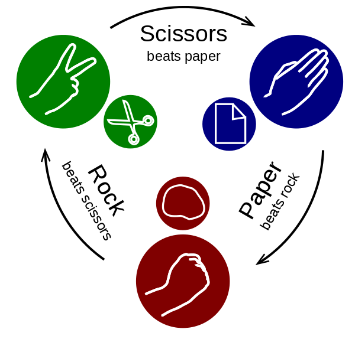

## Rock, Paper, Scissors Game

These general rules apply to all RPS (Rock, Paper, Scissors) games, its tripartite variants known in any permutation and/or combination of the following Scissors Paper Rock/Stone.

### Play now! :
  https://tossaworn.github.io/rock-paper-scissor/

### How to play :

1. Let's Play

2. Choose an option
  - Rock
  - Paper
  - Scissors  
3. Answer : Tie, PlayerWin, ComputerWin 

### Rules :

